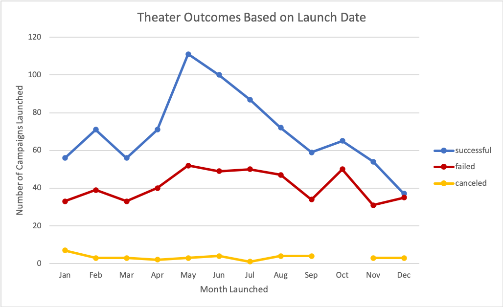
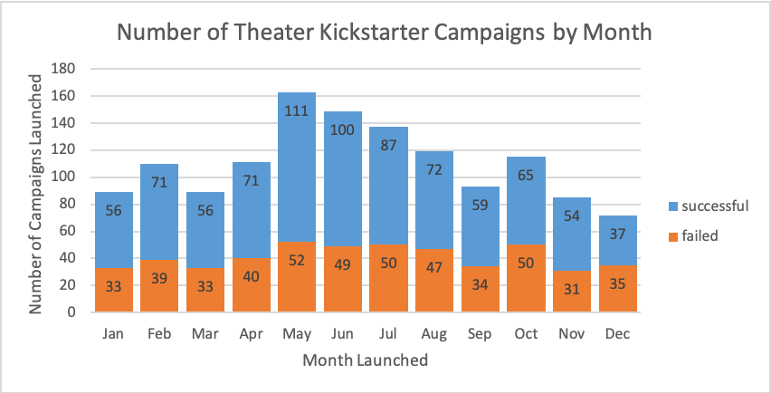
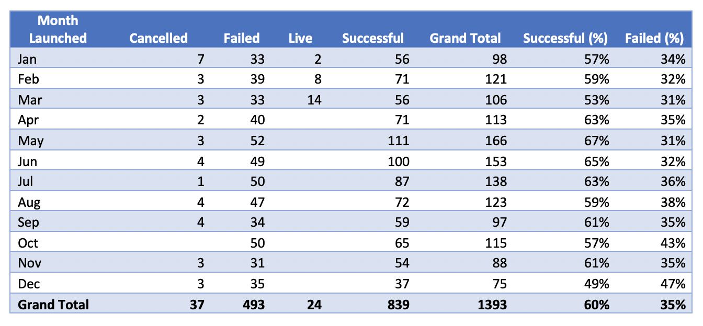
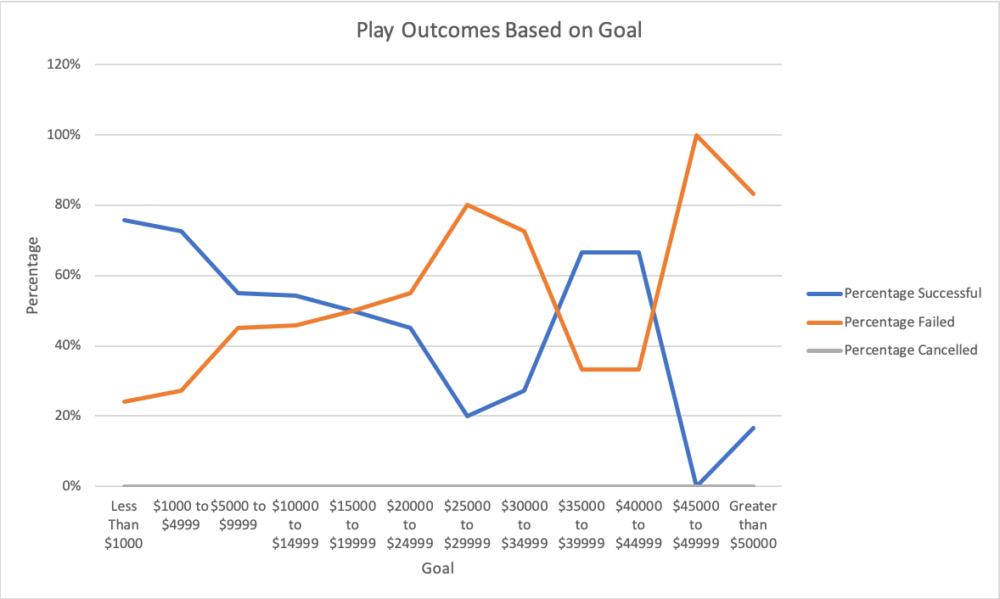

# **Kickstarter Campaigns: An Analysis**

## Overview

The scope of this analysis is to understand how different factors contribute to the success for failure of Kickstarter campaigns for theater productions and plays. Using Kickstarter data from variety of campaigns launched from May 2009 through March 2017, we will focus on campaigns for theater productions, specifically in reference to their launch date. We will also look at the relationship between a play’s campaign outcome and its set goal. We will take some time to understand the limitations of this dataset and analysis of this nature.

## Analysis

###### Theater Outcomes Based on Launch Date

We can make three immediate observations by considering the outcome of theater Kickstarter campaign based on its launch date as displayed in the figure above. First, a higher number of successful theater campaigns are launched in May, June, and July, respectively. Similarly, a higher number of failed theater campaigns are launched in May. Finally, nearly equal numbers of successful and failed campaigns were launched in December.

Although correlating the outcome of a campaign in relation to its launch date *can* provide some insight, this is not an indication of causation. This is to say that simply launching a campaign in May does not guarantee a successful funding campaign. We can verify this argument by addressing the opposite outcome in the same way. Most failed theater campaigns were *also* launched in May. Without deeper analysis, this would indicate that theater campaigns launched in May are also more likely to fail. How can that be true if our data is telling us more successful campaigns were launched in May? The figure below directly compares the number of successful campaigns to the number of failed campaigns by month during this reporting period. We see that for much of the year, theater campaigns are much more likely to meet their funding goals! In May and June, not only are more theater campaigns launched, they are roughly twice as likely to meet their goal. 

Before confirming our assumption that a theater campaign launched in May would be more likely to meet its funding goal than one launched in another month, let us take a look at all theater campaigns launched by month. The table below breaks out the success and fail rates of theater campaigns by month in reference to the total number of theater campaigns launched. We can see that if the 166 theater campaigns launched in May, 67% were successful. Considering all of the outcomes (cancelled, failed, live, and successful) gives us a more sophisticated understanding of the risk of launching a Kickstarter campaign for a theater production. 

###### Play Outcomes Based on Goal

The figure above outlines the outcomes of campaigns for plays in relation to their funding goal. Although there are exceptions, we can see that most successful campaigns set a lower more attainable goal while campaigns with higher goals had a higher rate of failure. While these figures give us an idea of what has occurred, we can’t see the efforts that helped achieve these goals. Perhaps lower funding goals are simply easier to achieve! Maybe we see a spike of successful campaigns around the $35,000 to $49,000 goal posts because these campaigns employed marketing tactics or inherently had a more enthusiastic base of backers.

## Challenges and Limitations

An analysis is only as strong as the data collected. We must consider when and how our data was gathered and ensure that it is accurate and relevant. Errors or incongruity in a data set can pose major foundational flaws that will be inherited by any hypothesis derived from the data. It is vital to ensure the data is accurate and robust enough to tell a story. This Kickstarter data was comprehensive but required some manipulation. I have reordered the columns to group related data together. I have also made a correction to the spelling of “cancelled” in the *Outcome* column as it was misspelled in the raw data. This may be a human error if this column was recorded manually. If this was an attribute of the reporting tool used to collect data, some review may be necessary. The Unix time stamp required translation in order to be utilized for analysis. The Unix time stamp is a method of identifying a point in time by reporting the number of seconds that have passed since January 1, 1970. This was accomplished by 60 seconds, then by 60 minutes, then by 24 hours, and finally adding the result to the date 01/01/1970. More information about the Unix time stamp and converting it for use can be found [here] (https://www.unixtimestamp.com/). Columns containing the converted launch and end dates have been added to the data set.

It can be challenging to predict what types of data are appropriate to collect. With the data provided, we have been able to make some initial conclusions about Kickstarter campaigns for theater productions and plays. However, had data been collected on the campaign backers, a deeper analysis on the success rate could be conducted. Understanding the locale, age group, or gender of backers and their individual donation size could set up future Kickstarter campaigns to target backers more strategically. Further data on the volume and timeline of pledges received could allow us to visualize the outcome of a campaign based on temporal events throughout its lifecycle. Do successful campaigns receive a lot attention right away? Do campaigns that receive below a certain number of pledges within the first twenty-four hours typically fail? Much can be distilled from longitudinal data of this sort.

As such, we can only tell part of the story! We can make strong assumptions about the correlation between a successful campaign and its funding goals or launch date, but without context for what makes a launch date in May more successful than a launch date in another month or why some campaigns with higher funding goals were successful, we cannot prescribe the formula for a successful Kicksarter campaign.

## Conclusion

Based on the data provided we can assume that theater campaigns are most commonly launched in late spring/early summer and are roughly twice as likely to successfully meet their funding goals. In general, theater campaigns are likely to succeed in reaching their funding goals. A higher number of successful campaigns were attributed to lower funding goals.

To fully understand what lends to a successful Kickstarter campaign, we would want to analyze further data from campaigns similar to ours or to future campaigns. This dataset is a fantastic place to begin and has informed us of some of the items we need to consider for future campaign analysis.

